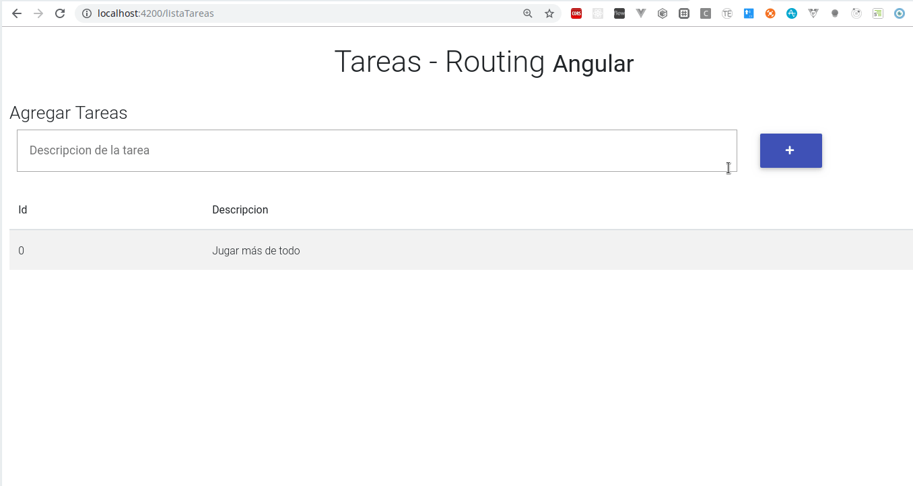
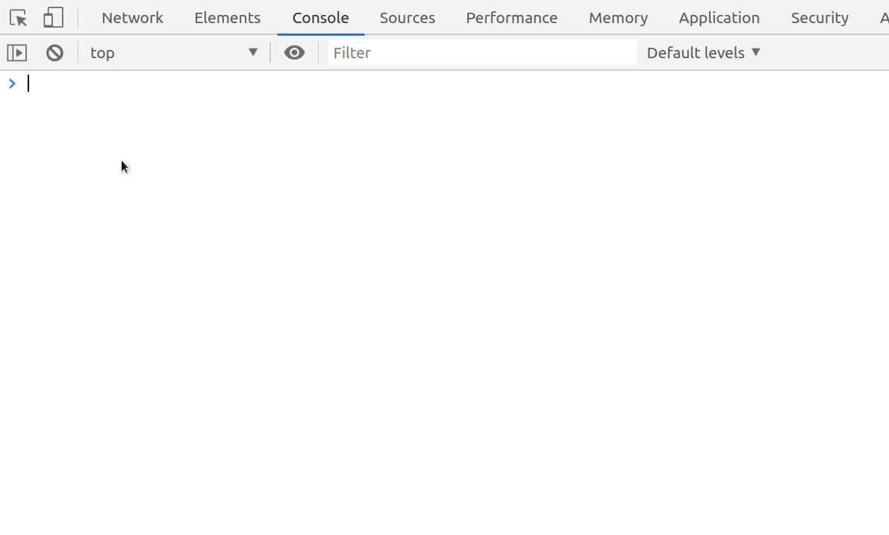

# Tareas (Routing con Angular)

[](https://github.com/uqbar-project/eg-tareas-routing-angular/actions/workflows/build.yml) 



## Creación de la aplicación con routing

La aplicación se debe crear indicando que queremos agregar el framework de ruteo de Angular, de la siguiente manera:

```bash
ng new eg-tareas-routing-angular --routing
```

[Este video](https://www.youtube.com/watch?v=Nehk4tBxD4o) es una introducción complementaria bastante recomendable.

## Componentes

Los componentes que generamos son el que mostrará la lista de tareas y el que permitirá editar una tarea:

```bash
ng g c editarTarea -is
```

La explicación de los modificadores para el comando ng son:

- `g` es por generate,
- `c` es por component,
- `-is` es por inline style, de manera de no crear un archivo css específico
- también existe la configuración `-it`, para no generar un html sino embeberlo dentro del archivo typescript, pero dado que la vista va a tener varias líneas no es algo recomendable.

Hacemos lo propio con el componente que lista (y agrega) tareas:

```bash
ng g c listaTareas -is
```

## Material Design for Bootstrap

Agregaremos la dependencia a Material Design for Bootstrap de la siguiente manera:

```bash
npm install mdbootstrap
```

# Definición de las rutas de la aplicación

El archivo _app-routing.module.ts_ generado permite definir las rutas de acceso de nuestra aplicación. En particular queremos

- por defecto ir hacia la vista que lista y agrega tareas
- y tener una vista para editar una tarea específica (cuando el usuario lo seleccione de la tabla). Para ello vamos a pasarle como parámetro el identificador de la tarea dentro de la URL.

Lo codificamos de esta manera:

```typescript
const routes: Routes = [
  { path: '',                redirectTo: '/listaTareas', pathMatch: 'full' },
       // por defecto redirigimos a lista de tareas
  { path: 'listaTareas',     component: ListaTareasComponent },
  { path: 'editarTarea/:id', component: EditarTareaComponent}
       // pasamos id dentro de la URL para editar una tarea específica: editarTarea/2, editarTarea/4
]
```

El módulo (definido en el mismo archivo _app-routing.module.ts_) importa las rutas que acabamos de definir...

```typescript
@NgModule({
  imports: [RouterModule.forRoot(routes)],
  exports: [RouterModule]
})
export class AppRoutingModule { }
```

... y también exporta una constante _routingComponents_, con todos los componentes de Angular que definiremos (en este caso es uno por ruta)

```typescript
export const routingComponents = [ ListaTareasComponent, EditarTareaComponent ]
```

Eso permite que la utilicemos en nuestro módulo general de Angular, archivo _app.module.ts_ (evitamos tener que mantener por duplicado la lista de componentes a importar):

```typescript
import { AppRoutingModule, routingComponents } from './app-routing.module'
import { AppComponent } from './app.component'

@NgModule({
  declarations: [
    AppComponent,
    routingComponents
  ],
  imports: [
    BrowserModule,
    FormsModule,
    AppRoutingModule
  ],
```

# Lista de tareas

## Vista

La vista tiene un binding bidireccional para cargar la descripción de la tarea en un _buffer_ intermedio antes de crear la tarea:

```html
<input [(ngModel)]="descripcionTarea" name="descripcionTarea" class="col-md-9" type="text" placeholder="Descripcion de la tarea">
```

También el botón tiene un binding del evento click para disparar el alta de una tarea:

```html
<button type="submit" class="btn btn-indigo" (click)="agregarTarea()">
```

Y por último, la tabla además de mostrar id y descripción de cada tarea dispara la edición mediante la propiedad _routerLink_:

```html
<tr *ngFor="let tarea of tareas" [routerLink]="['/editarTarea', tarea.id]">
  ...
```

- las directivas especiales de Angular tienen el prefijo *, como en `ngFor`
- el binding de la propiedad routerLink se hace al path `/editarTarea`. Es importante aquí anteponer la barra para redirigir a partir del raíz de la aplicación, de otra manera si solo definiéramos el routerLink a "editarTarea" dentro de este componente que está asociado al path "listarTareas", estaríamos intentando ir al path `listarTareas/editarTarea`. Además de "/editarTarea" pasamos como segundo parámetro el identificador de la tarea.
- por último con el moustache `{{ }}` se interpola el resultado del código tarea.id dentro del valor del tag a que estamos definiendo

## Componente

La lista de tareas se mapea directamente contra la propiedad tareas del service. El alta una tarea se delega al service, primero creando una tarea y luego agregándola a la colección de tareas conocida por la app.

```typescript
export class ListaTareasComponent implements OnInit {
  descripcionTarea = ''
  tareas: Tarea[] = []
  tareaSeleccionada: Tarea | undefined

  constructor(private tareaService: TareaService) {}

  agregarTarea() {
    const tarea = this.tareaService.crearTarea(this.descripcionTarea)
    this.tareaService.agregarTarea(tarea)
    this.descripcionTarea = ''
  }
```

La sintaxis

```typescript
  constructor(private tareaService : TareaService) {
```

permite definir una variable de instancia tareaService que es privada del componente. Luego se puede acceder en cualquier método, como vemos en agregarTarea():

```typescript
  agregarTarea() {
    const tarea = this.tareaService.crearTarea...
```

## Servicio DAO de Tareas

El service funciona como un DAO (Data Access Object), provee funcionalidades de creación, eliminación y búsqueda de tareas. Un dato importante es que debemos decirle que se inyecte mediante el decorador de Angular `@Injectable`:

```ts
@Injectable({
  providedIn: 'root'
})
export class TareaService {
  ...
```

 De esa manera podemos trabajar con un constructor injection en el componente `ListaTareasComponent`:


```ts
constructor(private tareaService : TareaService) {
```

Es decir, Angular automáticamente crea una instancia de TareaService y lo inyecta dentro del atributo del componente.

## Objeto de dominio Tarea

No hay nada interesante para contar, una tarea agrupa un identificador y su descripción.

# Editar tarea

## Componente

La ruta [http://localhost:4200/editarTarea/1](http://localhost:4200/editarTarea/1) recibe dentro del path el parámetro con el identificador de la tarea, que se convierte a un objeto Tarea gracias al servicio:

```typescript
export class EditarTareaComponent implements OnInit {

  tarea : Tarea
  descripcionTarea : string

  constructor(private tareaService: TareaService, private router : Router, private route : ActivatedRoute) {
    this.route.params.subscribe(params => {
      this.tarea = this.tareaService.getTareaById(params['id'])
      ...
    })
  }
```

El componente guarda en un estado intermedio la descripción de la tarea y también tiene dos métodos aceptar() y cancelar() que terminan navegando a la pantalla inicial. Esto lo hacemos en forma programática:

```typescript
navegarAHome() {
    this.router.navigate(['/listaTareas'])
}

aceptar() {
    this.tarea.descripcion = this.descripcionTarea
    this.navegarAHome()
}

cancelar() {
    this.navegarAHome()
}
```

## Vista html

La vista muestra el id en un input no editable, la descripción de la tarea (con binding bidireccional contra la referencia descripcionTarea del componente) y el binding de los botones Aceptar y Cancelar con los métodos aceptar() y cancelar() correspondientes.

```html
<div class="card-body">
    <div class="md-form">
        <p>Id</p>
        <input mdbInputDirective type="text" id="idTarea" class="form-control" value="{{tarea.id}}" readonly>
    </div>
    <div class="md-form">
        <p>Descripción</p>
        <input type="text" class="form-control" id="descripcionTarea" [(ngModel)]="descripcionTarea" aria-describedby="sizing-addon2">
    </div>
    <br>
    <a class="btn btn-primary waves-light" mdbWavesEffect (click)="aceptar()">Aceptar</a>
    <a class="btn btn-warning waves-light" mdbWavesEffect (click)="cancelar()">Cancelar</a>
</div>
```

# Testing

Dado que el test del servicio es el _default_ que genera Angular, nos concentraremos en contar los tests de la lista de tareas y de su edición.

## Lista de tareas

Para la lista de tareas, debemos configurar todos los imports que tiene la vista y esto incluye ahora el ruteo de la aplicación:

```typescript
describe('ListaTareasComponent', () => {
  let component: ListaTareasComponent
  let fixture: ComponentFixture<ListaTareasComponent>

  beforeEach(fakeAsync(() => {
    TestBed.configureTestingModule({
      declarations: [
        ListaTareasComponent,
        routingComponents
      ],
      imports: [
        FormsModule,
        RouterModule.forRoot(routes)
      ],
      providers: [
        { provide: APP_BASE_HREF, useValue: '/' }
      ]
    })
      .compileComponents()
    fixture = TestBed.createComponent(ListaTareasComponent)
    component = fixture.componentInstance
    // pedimos sincronizar modelo y vista
    fixture.detectChanges()
    // simulamos el paso del tiempo
    flushMicrotasks()
  }))
```

- para poder navegar a la pantalla principal, debemos proveer el _path_ hacia '/' que equivale a ir a la vista Lista de Tareas, esto es lo que hace la propiedad APP_BASE_HREF = '/' en la configuración providers.
- también debemos copiar los routingComponents en nuestras _declarations_
- y el import de las rutas definidas para el RouterModule (por eso debemos exportar la constante _routes_ desde el archivo _app-routing.module_)
- el beforeEach se encierra en una función `fakeAsync` que nos permite simular el paso del tiempo sin frenar a los tests (como lo haría la función `waitForAsync`). ¿Por qué es ésto? Porque Angular trae binding uni o bidireccional, pero necesita disparar eventos asincrónicos (que van al _event loop_) para poder sincronizar modelo y vista. Entonces mediante `fakeAsync` podemos controlar los eventos que ocurren, tenemos para ello las funciones `tick(milisegundos)` y `flushMicrotasks`.

Los tests específicos que creamos son dos:

- cuando la vista comienza no tenemos tareas cargadas (componente que delega la búsqueda de tareas al service)
- cuando agregamos una nueva tarea, esa tarea se visualiza en la tabla HTML de tareas; esto implica escribir en el input el valor, presionar el botón "+" y buscar la descripción dentro de esa tabla

```ts
  it('should contain no tasks initially', () => {
    expect(component.tareas.length).toEqual(0)
  })
  it('should show a new task in tasks table', fakeAsync(() => {
    const testingAngularDescription = 'Testing Angular'
    const compiled = fixture.debugElement.nativeElement
    component.descripcionTarea = testingAngularDescription
    // component.agregarTarea
    compiled.querySelector(`[data-testid="agregarTarea"]`).click()
    // Forzamos el binding de Angular
    fixture.detectChanges()
    // Disparamos los eventos asincrónicos
    flushMicrotasks()
    expect(compiled.querySelector('[data-testid="desc1"]').textContent).toContain(testingAngularDescription)
  }))
```

Para facilitar el test, modificamos la vista para que el `data-testid` de la segunda columna de cada tarea se forme con el prefijo "desc" + el identificador de la tarea:

```html
<tr *ngFor="let tarea of tareas" [routerLink]="['/editarTarea', tarea.id]">
    <td>
        {{tarea.id}}
    </td>
    <td [attr.data-testid]="'desc' + tarea.id">
```

Esto permite buscar en el HTML resultante un tag cuyo `data-testid` sea "desc1".

## Editar Tarea

Este test necesita simular la edición de una tarea. Como nuestro service no tiene ninguna tarea en su colección, creamos un StubTareaService que genera dos tareas.

```typescript
providers: [
  ...,
  { provide: TareaService, useValue: new StubTareaService() }
```

El StubTareaService simplemente hereda del TareaService y define su lista de tareas:

```typescript
@Injectable({
  providedIn: 'root'
})
export class StubTareaService extends TareaService {
  constructor() {
    super()
    this.tareas = [
      this.crearTarea('Aprender Angular'),
      this.crearTarea('Aprender Routing de Angular'),
      this.crearTarea('Desarrollar app en Angular'),
    ]
  }
}
```

También debemos simular que el usuario navegó para editar el segundo elemento, es decir que viene de la página principal y al hacer click sobre la segunda tarea esto disparó el siguiente link:

[http://localhost:4200/editarTarea/2](http://localhost:4200/editarTarea/2)

Tenemos que _mockear_ el objeto ActivatedRoute para que cuando preguntemos qué parámetro vino nos conteste 2.

## Algo de funciones

Definimos una función subscribe:

```ts
function subscribe(fn: (value: Data) => void) {
  fn({ id: 2 })
}
```

- subscribe recibe como parámetro una función, que recibe un valor y no devuelve nada (`void`)
- lo que hace es aplicar la función que recibimos como parámetro pasándole un objeto, que tiene un atributo `id` cuyo valor es 2

Esta definición es equivalente a hacer:

```ts
const subscribe = (fn: (value: Data) => void) {
  fn({ id: 2})
}
```

solo que estamos usando la notación de [**lambdas / arrows functions** de javascript](https://developer.mozilla.org/en-US/docs/Web/JavaScript/Reference/Functions/Arrow_functions).

Utilizando la sintaxis de lambdas podemos hacer lo mismo en un navegador:

```js
const saludar = (persona) => 'Hola ' + persona
      // definimos saludar como una fn
saludar
      // es una función
saludar('Rodri')
      // la invocamos, el equivalente a apply
```



De la misma manera podemos construir una función, como un bloque:

```ts
const sumar = () => 1 + 1
sumar                       // es la función
sumar()                     // la invocamos -> devuelve 2
```

Relacionado, pueden ver [este artículo sobre Lambdas en Java 8](http://wiki.uqbar.org/wiki/articles/lambdas-en-java-8.html).

## Simulando la edición de la segunda tarea

Ahora sí, podemos pasarle una función a la ruta para que simule ir a la segunda tarea. Para eso le pasamos la función que acabamos de crear:

```typescript
providers: [
  ...,
  {
    provide: ActivatedRoute,
    useValue: {
      params: {
        subscribe: subscribe,
      }
    }
  },
```

A partir de ES6, si queremos definir un objeto de la siguiente manera:

```js
const nombreCientifico = 'Prunus persica'
const durazno = {
  nombreCientifico: nombreCientifico,
}
```

también se puede escribir de la siguiente manera:

```js
const nombreCientifico = 'Prunus persica'
const durazno = {
  nombreCientifico,
}
```

Por lo tanto nuestro código queda:

```ts
providers: [
  ...,
  {
    provide: ActivatedRoute,
    useValue: {
      params: {
        subscribe,
      }
    }
  },
```

Al igual que hicimos para la lista de tareas el path default de nuestra aplicación con "/":

```typescript
      providers: [
        { provide: APP_BASE_HREF, useValue: '/' },
        ...
```

e inyectamos las rutas y los componentes de la misma manera (el lector puede ver el archivo [editar-tarea.component.spec](./editar-tarea/editar-tarea.component.spec)).

El test más importante es el que prueba que en el input se visualiza la descripción de la segunda tarea de nuestro StubService, asumiendo que en el beforeEach ya trabajamos con un fakeAsync y simulamos el paso del tiempo:

```typescript
  it('should show the description for a certain task', () => {
    const compiled = fixture.debugElement.nativeElement
    expect(compiled.querySelector('[data-testid="descripcionTarea"]').value).toContain('Aprender Routing de Angular')
  })
```
