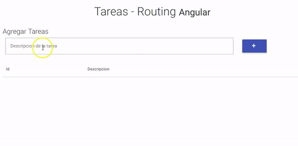

# Tareas (Routing con Angular)

[](https://travis-ci.org/uqbar-project/eg-tareas-routing-angular)



[Este video](https://www.youtube.com/watch?v=Nehk4tBxD4o) es una introducción complementaria bastante recomendable.

## Creación de la aplicación con routing

La aplicación se debe crear indicando que queremos agregar el framework de ruteo de Angular, de la siguiente manera:

```bash
$  ng new eg-tareas-routing-angular --routing
```

## Componentes

Los componentes que generamos son el que mostrará la lista de tareas y el que permitirá editar una tarea:

```bash
$ ng g c editarTarea -is
```

La explicación de los modificadores para el comando ng son:

- g es por generate, 
- c es por component, 
- is es por inline style, de manera de no crear un archivo css específico
- también existe la configuración it, para no generar un html sino embeberlo dentro del archivo typescript, pero dado que la vista va a tener varias líneas no es algo recomendable.

Hacmemos lo propio con el componente que lista (y agrega) tareas:

```bash
$ ng g c listaTareas -is
```

## Material Design for Bootstrap

Agregaremos la dependencia a Material Design for Bootstrap de la siguiente manera:

```bash
$ npm install mdbootstrap --save
```

# Definición de las rutas de la aplicación

El archivo _app-routing.module.ts_ generado permite definir las rutas de acceso de nuestra aplicación. En particular queremos

- por defecto ir hacia la vista que lista y agrega tareas
- y tener una vista para editar una tarea específica (cuando el usuario lo seleccione de la tabla). Para ello vamos a pasarle como parámetro el identificador de la tarea dentro de la URL.

Lo codificamos de esta manera:

```typescript
const routes: Routes = [
  { path: '',                redirectTo: '/listaTareas', pathMatch: 'full' },
       // por defecto redirigimos a lista de tareas
  { path: 'listaTareas',     component: ListaTareasComponent },
  { path: 'editarTarea/:id', component: EditarTareaComponent} 
       // pasamos id dentro de la URL para editar una tarea específica: editarTarea/2, editarTarea/4
]
```

El módulo importa las rutas que acabamos de definir...

```typescript
@NgModule({
  imports: [RouterModule.forRoot(routes)],
  exports: [RouterModule]
})
export class AppRoutingModule { }
```

... y también exporta una constante _routingComponents_, con todos los componentes de Angular que definiremos (en este caso es uno por ruta)

```typescript
export const routingComponents = [ ListaTareasComponent, EditarTareaComponent ]
```

Eso permite que la utilicemos en nuestro módulo general de Angular, archivo _app.module.ts_ (evitamos tener que mantener por duplicado la lista de componentes a importar):

```typescript
import { AppRoutingModule, routingComponents } from './app-routing.module'
import { AppComponent } from './app.component'

@NgModule({
  declarations: [
    AppComponent,
    routingComponents
  ],
  imports: [
    BrowserModule,
    FormsModule,
    AppRoutingModule
  ],
```

# Lista de tareas

## Componente

El componente que lista las tareas tiene

- un texto + un botón para dar de alta una tarea
- una tabla que muestra las tareas existentes

La lista de tareas se mapea directamente contra la propiedad tareas del service. Para dar de alta una tarea se delega también dicha responsabilidad al service:

```typescript
export class ListaTareasComponent implements OnInit {
  descripcionTarea : string = ""
  tareas : Array<Tarea>
  tareaSeleccionada : Tarea
  
  constructor(private tareaService : TareaService) {
    this.tareas = this.tareaService.tareas
  }

  agregarTarea() {
    const tarea = this.tareaService.crearTarea(this.descripcionTarea)
    this.tareaService.agregarTarea(tarea)
    this.descripcionTarea = ''
  }
```

## Servicio DAO de Tareas

El service funciona como un DAO (Data Access Object), provee funcionalidades de creación, eliminación y búsqueda de tareas:

```typescript
export class TareaService {
  tareasIds: number
  tareas: Array<Tarea>

  constructor() {
    this.tareasIds = 0
    this.tareas = []
  }

  crearTarea(description) {
    let tarea = new Tarea(description)
    tarea.id = this.tareasIds++
    return tarea
  }

  agregarTarea(tarea) {
    this.tareas.push(tarea)
  }

  getTareaById(id) {
    return this.tareas.find((tarea) => {
      return tarea.id == id
    })
  }

}
```

## Objeto de dominio Tarea

No hay nada interesante para contar, una tarea agrupa un identificador y su descripción.

## Vista

La vista tiene un binding bidireccional para cargar la descripción de la tarea en un _buffer_ intermedio antes de crear la tarea:

```html
<input [(ngModel)]="descripcionTarea" name="descripcionTarea" class="col-md-9" type="text" placeholder="Descripcion de la tarea">
```

También el botón tiene un binding del evento click para disparar el alta de una tarea:

```html
<button type="submit" class="btn btn-indigo" (click)="agregarTarea()">
```

Y por último, la tabla además de mostrar id y descripción de cada tarea dispara la edición mediante la propiedad _routerLink_:

```html
<tr *ngFor="let tarea of tareas">
    <td>
        <a [routerLink]="['/editarTarea', tarea.id]">{{tarea.id}}</a>
    </td>
    <td>
        <a [routerLink]="['/editarTarea', tarea.id]">{{tarea.descripcion}}</a>
    </td>
</tr>
```

- las directivas especiales de Angular tienen el prefijo *, como en ngFor
- el binding de la propiedad routerLink se hace al path "/editarTarea". Es importante aquí anteponer la barra para redirigir a partir del raíz de la aplicación, de otra manera si solo definiéramos el routerLink a "editarTarea" dentro de este componente que está asociado al path "listarTareas", estaríamos intentando ir al path "listarTareas/editarTarea". Además de "/editarTarea" pasamos como segundo parámetro el identificador de la tarea.
- por último con el moustache `{{ }}` se interpola el resultado del código tarea.id dentro del valor del tag a que estamos definiendo

# Editar tarea

## Componente

La ruta http://localhost:4200/editarTarea/1 recibe dentro del path el parámetro con el identificador de la tarea, que se convierte a un objeto Tarea gracias al servicio:

```typescript
export class EditarTareaComponent implements OnInit {

  tarea : Tarea
  descripcionTarea : string

  constructor(private tareaService: TareaService, private router : Router, private route : ActivatedRoute) {
    this.router = router
    
    this.route.params.subscribe(params => {
      this.tarea = this.tareaService.getTareaById(params['id'])
      ...
    })
    
  }
```

El componente guarda en un estado intermedio la descripción de la tarea y también tiene dos métodos aceptar() y cancelar() que terminan navegando a la pantalla inicial. Esto lo hacemos en forma programática:

```typescript
navegarAHome() {
    this.router.navigate(['/listaTareas'])
}

aceptar() {
    this.tarea.descripcion = this.descripcionTarea
    this.navegarAHome()
}

cancelar() {
    this.navegarAHome()
}
```

## Vista html

La vista muestra el id en un input no editable, la descripción de la tarea (con binding bidireccional contra la referencia descripcionTarea del componente) y el binding de los botones Aceptar y Cancelar con los métodos aceptar() y cancelar() correspondientes.

```html
<div class="card-body">
    <div class="md-form">
        <p>Id</p>
        <input mdbInputDirective type="text" id="idTarea" class="form-control" value="{{tarea.id}}" readonly>
    </div>
    <div class="md-form">
        <p>Descripción</p>
        <input type="text" class="form-control" id="descripcionTarea" [(ngModel)]="descripcionTarea" aria-describedby="sizing-addon2">
    </div>
    <br>
    <a class="btn btn-primary waves-light" mdbWavesEffect (click)="aceptar()">Aceptar</a>
    <a class="btn btn-warning waves-light" mdbWavesEffect (click)="cancelar()">Cancelar</a>
</div>
```

# Testing

Dado que el test del servicio es el _default_ que genera Angular, nos concentraremos en contar los tests de la lista de tareas y de su edición.

## Lista de tareas

Para la lista de tareas, debemos configurar todos los imports que tiene la vista y esto incluye ahora el ruteo de la aplicación:

```typescript
describe('ListaTareasComponent', () => {
  let component: ListaTareasComponent
  let fixture: ComponentFixture<ListaTareasComponent>

  beforeEach(async(() => {
    TestBed.configureTestingModule({
      declarations: [
        ListaTareasComponent,
        routingComponents
      ],
      imports: [
        FormsModule,
        RouterModule.forRoot(routes)
      ],
      providers: [
        { provide: APP_BASE_HREF, useValue: '/' }
      ]
    })
    .compileComponents()
  }))
```

- para poder navegar a la pantalla principal, debemos proveer el _path_ hacia '/' que equivale a ir a la vista Lista de Tareas, esto es lo que hace la propiedad APP_BASE_HREF = '/' en la configuración providers.
- también debemos copiar los routingComponents en nuestras _declarations_ 
- y el import de las rutas definidas para el RouterModule (por eso debemos exportar la constante _routes_ desde el archivo _app-routing.module_)

Los tests específicos que creamos son dos:

- cuando la vista comienza no tenemos tareas cargadas (componente que delega la búsqueda de tareas al service)
- cuando agregamos una nueva tarea, esa tarea se visualiza en la tabla HTML de tareas; esto implica escribir en el input el valor, presionar el botón "+" y buscar un tag td que tenga la descripción

```typescript
  it('should contain no tasks initially', () => {
    expect(component.tareas.length).toEqual(0)
  })
  it('when adding a new task it should appear in tasks table', () => {
    component.descripcionTarea = "Testing Angular"
    component.agregarTarea()
    fixture.detectChanges()
    const compiled = fixture.debugElement.nativeElement
    expect(compiled.querySelector('#desc0').textContent).toContain('Testing Angular')
  })
```

Para facilitar el test, modificamos la vista para que el id de la segunda columna de cada tarea se forme con el prefijo "desc" + el identificador de la tarea:

```html
<tr *ngFor="let tarea of tareas">
    <td>
        <a [routerLink]="['/editarTarea', tarea.id]">{{tarea.id}}</a>
    </td>
    <td>
        <a [routerLink]="['/editarTarea', tarea.id]" id="desc{{tarea.id}}">{{tarea.descripcion}}</a>
    </td>
```

Esto permite buscar en el HTML resultante un tag cuyo id sea "desc0".

## Editar Tarea

Este test necesita simular la edición de una tarea. Como nuestro service no tiene ninguna tarea en su colección, creamos un StubTareaService que genera dos tareas.

```typescript
providers: [
  ...,
  { provide: TareaService, useValue: new StubTareaService() }
```

El StubTareaService simplemente hereda del TareaService y define su lista de tareas:

```typescript
@Injectable({
  providedIn: 'root'
})
export class StubTareaService extends TareaService {
  constructor() {
    super()
    this.tareas = [ this.crearTarea("Aprender Angular"), this.crearTarea("Aprender Routing de Angular"), this.crearTarea("Desarrollar app en Angular")]
  }
}
```

También debemos simular que el usuario navegó para editar el segundo elemento, es decir que viene de la página principal y al hacer click sobre la segunda tarea esto disparó el siguiente link:

http://localhost:4200/editarTarea/1

Para hacer eso _mockeamos_ el objeto ActivatedRoute para que cuando preguntemos qué parámetro vino nos conteste 1:

```typescript
providers: [
  ...,
  {
    provide: ActivatedRoute,
    useValue: {
      params: {
        subscribe: (fn: (value: Data) => void) => fn({
          id: 1
        })
      }
    }
  },
```

Al igual que hicimos para la lista de tareas el path default de nuestra aplicación con "/":

```typescript
      providers: [
        { provide: APP_BASE_HREF, useValue: '/' },
        ...
```

e inyectamos las rutas y los componentes de la misma manera (el lector puede ver el archivo [editar-tarea.component.spec](./editar-tarea/editar-tarea.component.spec)).

El test más importante es el que prueba que en el input se visualiza la descripción de la segunda tarea de nuestro StubService:

```typescript
  it('should show task description for id 1', () => {
    const compiled = fixture.debugElement.nativeElement
    fixture.whenStable().then(() => {
      expect(compiled.querySelector('#descripcionTarea').value).toContain('Aprender Routing de Angular')
    }) 
  })
```
