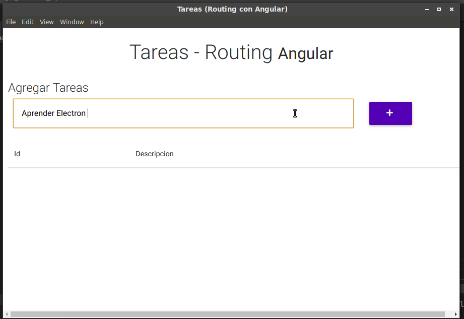

# Tareas (Routing con Angular)

[](https://travis-ci.org/uqbar-project/eg-tareas-routing-angular)

# Versión con Electron JS

Este branch permite ver la misma app en un entorno de escritorio del sistema operativo que vos tengas, siguiendo [estos pasos](https://angularfirebase.com/lessons/desktop-apps-with-electron-and-angular/). La tecnología que hace esto posible es [Electron](https://electronjs.org/).

# Cambios necesarios a la aplicación

Primero que nada tenés que agregar electron como dependencia de desarrollo:

```bash
> npm install electron -D
```

Crearemos un archivo `main.js` que se ubicará en el directorio raíz (no confundir con `main.ts` que es el que utiliza Angular para levantar su browser). También podríamos haberlo escrito en Typescript, solo que debemos transpilarlo luego y eso requiere un paso adicional.

El archivo `main.js` tiene esta definición

```js
const { app, BrowserWindow } = require('electron')
const url = require("url")
const path = require("path")

let win

function createWindow () {
  // Create the browser window.
  win = new BrowserWindow({
    width: 900,
    height: 600,
    backgroundColor: '#ffffff',
  })

  win.loadURL(
    url.format({
      // parte más sensible: tienen que apuntar donde está el index.html del dist
      pathname: path.join(__dirname, `/dist/eg-tareas-routing-angular/index.html`),
      // fin de parte más sensible
      protocol: "file:",
      slashes: true
    })
  )

  // Event when the window is closed.
  win.on('closed', function () {
    win = null
  })
}

// Create window on electron intialization
app.on('ready', createWindow)

// Quit when all windows are closed.
app.on('window-all-closed', function () {

  // On macOS specific close process
  if (process.platform !== 'darwin') {
    app.quit()
  }
})

app.on('activate', function () {
  // macOS specific close process
  if (win === null) {
    createWindow()
  }
})
```

Una vez hecho esto, modificamos el `package.json` para que corra los scripts de electron y además le decimos que utilice como main el `main.js`:

```json
{
  "name": "eg-tareas-routing-angular",
  "version": "0.0.0",
  "main": "main.js",
  "scripts": {
    "ng": "ng",
    "start": "ng serve",
    "build": "ng build",
    "test": "ng test",
    "lint": "ng lint",
    "e2e": "ng e2e",
    "electron": "electron .",
    "electron-build": "ng build --prod && electron ."
  },
```

Los valores a actualizar son:

- main
- electron
- electron-build

Un detalle muy importante es que en el archivo `index.html` que se ubica dentro de la carpeta `src` hay que modificar el href base, agregándole un punto `./` en lugar de `/`:

```html
<!doctype html>
<html lang="en">
<head>
  <meta charset="utf-8">
  <title>Tareas (Routing con Angular)</title>
  <base href="./">
```

Luego hacemos el build del proyecto, lo que genera la carpeta `dist`:

```bash
> ng build --prod
```

Y por último levantamos la aplicación Electron:

```bash
> npm run electron-build
```

Lo que nos permitirá ver la app desde nuestro sistema operativo:

